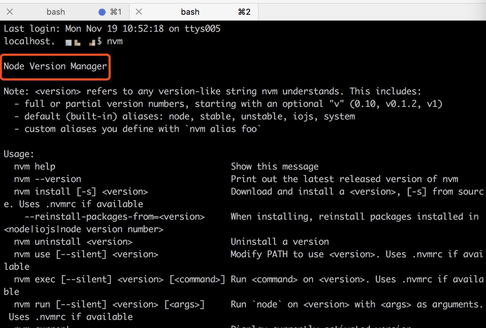
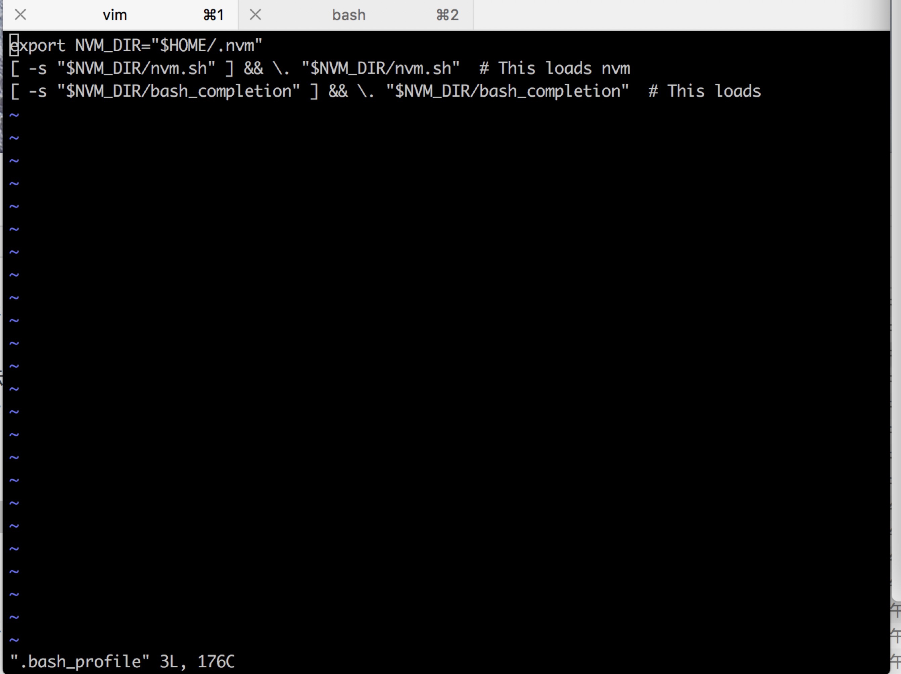

## MAC OS下NVM的安装
### npm, node, npm之间的区别
1. nvm：**nodejs 版本管理工具。**
也就是说：一个 nvm 可以管理很多 node 版本和 npm 版本。
2. nodejs：在项目开发时的所需要的代码库。
3. npm：nodejs 包管理工具。
在安装的 nodejs 的时候，npm 也会跟着一起安装，它是包管理工具。
**npm 管理 nodejs 中的第三方插件**。

### 安装nvm
安装命令

```
curl -o- https://raw.githubusercontent.com/creationix/nvm/v0.33.8/install.sh | bash
```

or Wget

```
wget -qO- https://raw.githubusercontent.com/creationix/nvm/v0.33.8/install.sh | bash
```

**安装完成后关闭终端，重新打开终端**输入nvm验证是否成功，当出现**"Node Version Manager"**时，说明安装成功。


如果在新的终端提示： **command not found:nvm**,可能是你的系统缺少一个
**.bash_profile** 文件
* **vim .bash_profile**
* **i** 进入编辑模式
* 粘贴一下代码后，**:wq** 保存退出

```
export NVM_DIR="$HOME/.nvm"
[ -s "$NVM_DIR/nvm.sh" ] && \. "$NVM_DIR/nvm.sh"  # This loads nvm
[ -s "$NVM_DIR/bash_completion" ] && \. "$NVM_DIR/bash_completion"  # This loads nvm bash_completion
```



**注意：如果你安装了 oh my zsh ，需要在 .zshrc 文件去添加以上配置信息**

* 重新打开一个 terminal 窗口或标签页，输入**nvm**
* 如果上面没有解决问题，打开你的 .bash_profile 文件，并添加以下代码：
**source ~/.bashrc**，保存更改


